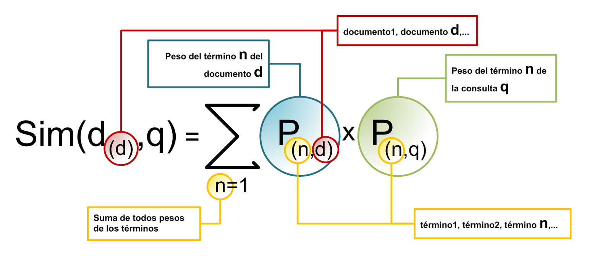
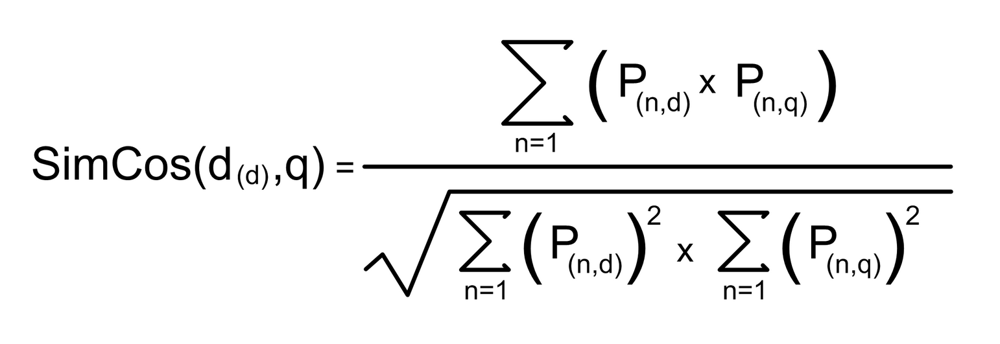
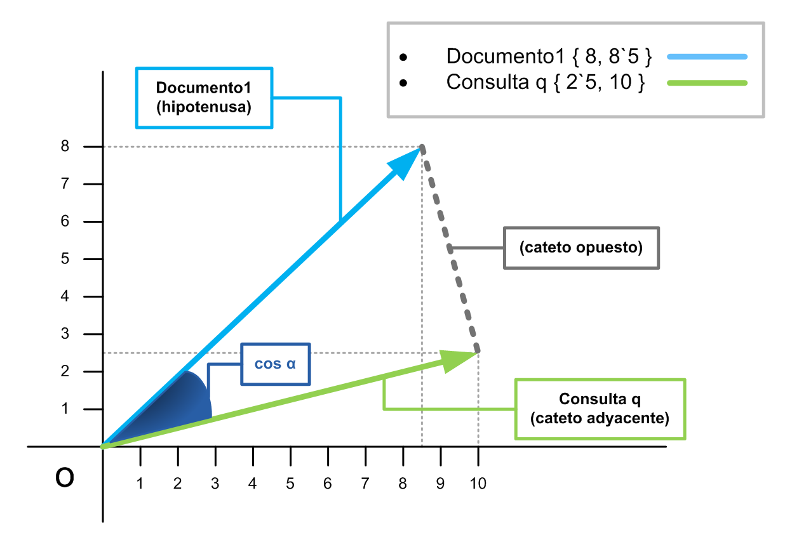
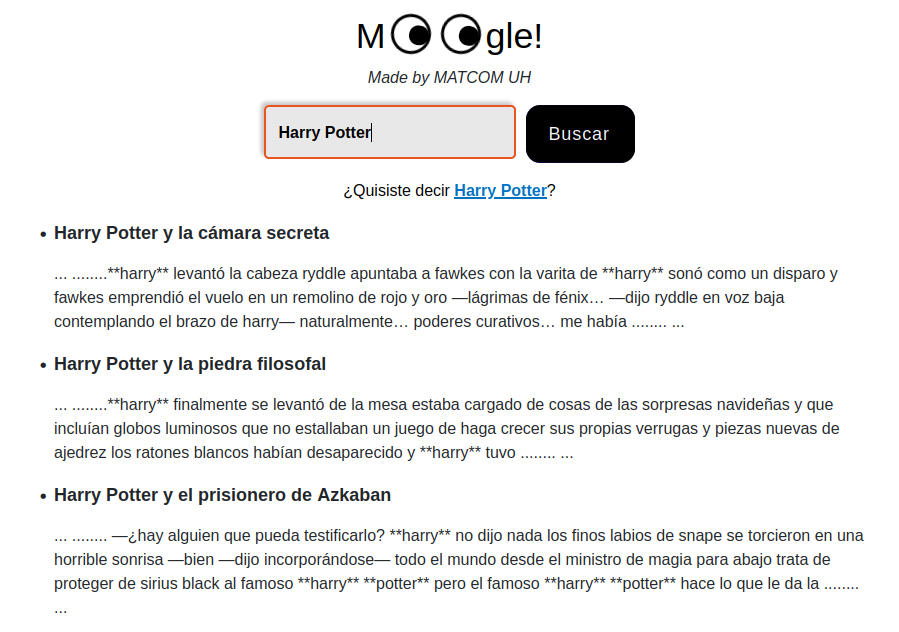
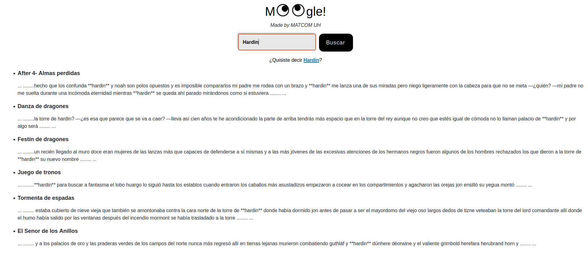
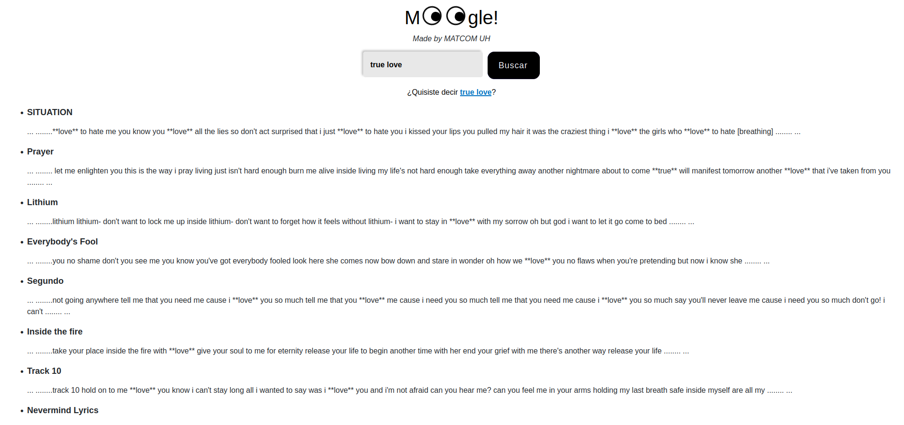

# Moogle!


> Proyecto de Programación I.
> Facultad de Matemática y Computación - Universidad de La Habana.
> Cursos 2023-2024.

**Moogle!** es una aplicación *totalmente original* cuyo propósito es buscar inteligentemente un texto en un conjunto de documentos.

Es una aplicación web, desarrollada con tecnología .NET Core 7.0, específicamente usando Blazor como *framework* web para la interfaz gráfica, y en el lenguaje C#.
La aplicación está dividida en dos componentes fundamentales:

- `MoogleServer` es un servidor web que renderiza la interfaz gráfica y sirve los resultados.
- `MoogleEngine` es una biblioteca de clases donde está implementada la lógica del algoritmo de búsqueda.

**Índice**

1. [Sobre la búsqueda](#id1)
2. [Flujo de Funcionamiento](#id2)
3. [Arquitectura básica](#id3)
4. [Similaridad producto escalar](#id4)
5. [Similaridad coseno](#id5)
6. [Sobre la Ingeniería de Software](#id6)
7. [Ejemplos del proyecto en funcionamiento](#id7)
8. [Fuentes que utilicé](#id8)


# Sobre la búsqueda <a name = "id1"> </a>

#### Necesitas tener instaldo algún navegador y tener a dotnet disponible, o equivalente a esto tener .NET CORE 7.0 instalado, para ejecutarlo te debes ubicar en la carpeta del proyecto y ejecutar en la terminal de Linux:

```cs
make dev
```

#### Si estás en Windows, debes poder hacer lo mismo desde la terminal del WSL (Windows Subsystem for Linux), el comando ultimate para ejecutar la aplicación es (desde la carpeta raíz del proyecto):

```cs
dotnet watch run --project MoogleServer
```

#### Para realizar una búsqueda, solo se necesita introducir una frase en el cuadro de búsqueda y hacer click sobre el botón buscar o bien, presionar la tecla Enter.

#### Implementamos la búsqueda de la manera más inteligente posible, de forma tal que el usuario no necesita limitarse a los documentos donde aparece exactamante la frase introducida por el usuario. 

 #### Aquí van algunos requisitos que debe cumplir esta búsqueda:

- En primer lugar, el usuario puede buscar no solo una palabra sino en general una frase cualquiera.
- Si no aparecen todas las palabras de la frase en un documento, pero al menos aparecen algunas, este documento también será devuelto, pero con una relevancia menor mientras menos palabras aparezcan.
- El orden en que aparezcan en el documento los términos de la consulta en general no importa, ni siquiera que aparezcan en lugares totalmente diferentes del documento.
- De la misma forma, si un documento tiene más términos de la consulta que otro, en general tiene una mayor relevancia (a menos que sean términos menos relevantes).
- Algunas palabras excesivamente comunes como las preposiciones, conjunciones, etc., serán ignoradas por completo ya que aparecerán en la inmensa mayoría de los documentos. Este requisito es funcional dentro de un conjunto de archivos en un mismo idioma, ya que está programado para que se haga de forma automática, o sea, no hay una lista cableada de palabras a ignorar, sino que se computan de los documentos.

# Flujo de Funcionamiento <a name = "id2"> </a>
#### Al iniciar el servidor , este crea una instancia de Searcher el cual carga los Documentos  y los procesa individualmente para obtener los datos relevantes sobre ellos, tales como su nombre, ruta y frecuencia de sus términos, estos luego son utilizados para crear un diccionario que contiene todos los términos del corpus textual (los documentos), con esto se calcula por cada término de cada documento su frecuencia inversa o IDF y se utiliza esta métrica para normalizar la frecuencia del término en el documento (TF) y asi definir la relevancia de cada uno en el documento y en el corpus, estos valores son almacenados para utilizarse en las búsquedas.

#### Cuando un usuario realiza una consulta mediante la interfaz gráfica esta pasa al servidor donde se procesan los datos introducidos por el usuario tales como: separar y procesar los terminos y calcular a cada uno de ellos su relevancia de la misma manera que se efectuó con cada documento del corpus. Tras desarrollarlo se procede a reducir el espacio de búsqueda mediante el cálculo de la relevancia o score de cada documento respecto al query, esto se cubre utilizndo la distancia coseno entre vectores la cual es una medida de similitud entre vectores, luego de calcular todos los scores , se organiza la lista de documentos según su score de mayor a menor y se devuelven al usuario, si hubo alguna palabra que no se pudo encontrar no será devuelto ningún resultado y el usuario debrá realizar una nueva búsqueda.

# Arquitectura básica <a name = "id3"> </a>
#### Este proyecto utiliza una implementación del *modelo vectorial de recuperación de la información*. Este modelo tiene su base en el álgebra lineal multidimensional, y onsite en modelar los documentos y la consulta como vectores en un espacio donde cada componente del vector representa el grado de relevancia de un término, la dimension de este espacio sera igual a la cantidad de términos distintos que existan en el corpus de documentos. Para medir la relevancia se utilizó los pesos TF-IDF, TF significa Term Frequency o frecuencia del término en español y es la cantidad de veces que un término aparece en un documento dado dividido por el número total de palabras en un documento, IDF significa Inverse Document Frecuency o Frecuencia inversa de documento en español y se calcula con la siguiente fórmula Log10(n/d), donde n es la cantidad total de documentos y d la cantidad de documentos es los que aparece el término, en caso de que el término no aparezca en ningún documento el valor del IDF es 0. La multiplicación de estos dos valores representa la relevancia del término en los documentos. Los valores de relevancia guardan en las componentes de los vectores de los documentos y la consulta como medida final de la relevancia de cada término.
#### Una vez modelado el sistema vectorial con la relevancia de cada término, solo nos queda por determinar el grado de similitud entre la consulta y los documentos 
#### El modo más simple de calcular la similitud entre una consulta y un documento, utilizando el modelo vectorial, es realizar el producto escalar de los vectores que los representan. En esa ecuación se incluye la normalización de los vectores, a fin de obviar distorsiones producidas por los diferentes tamaños de los documentos. El índice de similitud más usado es el coseno del ángulo formado por ambos vectores. 
#### Para una consulta q, el índice de similitud con un documento Di es:

# Similaridad producto escalar <a name = "id4"> </a>


# Similaridad coseno <a name = "id5"> </a>



Los documentos con mayor grado de similitud son aquellos que mayor **score** tendrán. Los documentos de mayor **score** serán los devueltos por el buscador.

Si desea seguir documentadose sobre esto puede dirigirse a: https://es.wikipedia.org/wiki/Modelo_vectorial_generalizado


# Sobre la Ingeniería de Software <a name = "id6"> </a>
#### Para implementar el algoritmo de búqueda hemos creado e implementado varias clases fundamentales. Cada clase es una abstracción de los componentes del motor de búsqueda.

+ `DataFile` es una clase creada como representación de lo que es un documento.
+ `DataFolder` por su parte, representa una carpeta o contenedor de documentos (o DataFiles), con sus propiedades y métodos proprios.
+ `Query` es la clase que representa y procesa la consulta realizada por el usuario.
+ `Tools` Contiene herramientas (métodos) para procesar texto.
+ `Engine` es una clase base que se encarga de manejar los objetos de tipo `DataFile`, `DataFolder` y `Query` para la obtención de objetos de tipo `SearItem` y posteriormente de tipo `SearchResult` que son los devueltos al usuario. 
+ `SearchItem` representa objetos que son posibles documentos que coinciden al menos parcialmente con la consulta en `Query`.
+ `SearchResult` representa un objeto que contiene los resultados de la búsqueda realizada por el usuario.
+ `Moogle` contiene el método `Moogle.Query`. Este método devuelve un objeto de tipo `SearchResult`.


# Clase DataFile
**Propiedades de la clase**
```cs
public string FileRoot {get; private set;} // ruta del archivo

public string FileName {get; private set;} // nombre del archivo

public string FileContent {get; private set;} // contenido del archivo sin procesar

public int FileWords {get; private set;} // cantidad de palabras por archivo

public string[] AllWordsOnFile {get; set;} // array que contiene todas las palabras del archivo

public Dictionary <string, float> WordFreq {get; set;} // diccionario que contiene el conjunto de palabras de un documento y su TF
```
**Constructor de la clase**
#### El objeto  `DataFile` recibe un su constructor un argumento root, que vendría siendo la ruta del documento dentro de la carpeta de documentos.
```cs
public DataFile(string root)
    {   
        FileRoot = root;
        FileName = Path.GetFileName(root); // obtenemos el nombre del archivo con su extension
        FileName = Path.ChangeExtension(FileName, null); // anulamos la extension

        StreamReader reader = new StreamReader(root); // leemos el contenido del archivo
        FileContent = reader.ReadToEnd();
        reader.Close(); 
        AllWordsOnFile = Tools.TxtProcesser(FileContent); // procesamos el contenido del archivo
        FileWords = AllWordsOnFile.Length; 
        WordFreq = new Dictionary<string, float>();
        float maxFreq = 0;

            foreach(string word in AllWordsOnFile)
            {  
                if(!WordFreq.Keys.Contains(word)) // si la palabra no estaba en el documento la cargamos y aparece 1 vez
                {
                    WordFreq.Add(word, 1);
                }
                else // si la palabra ya estaba en el documento aumentamos su valor en 1
                {
                    WordFreq[word]++;
                    maxFreq = Math.Max(maxFreq , WordFreq[word]);
                }
            }

            foreach(string key in WordFreq.Keys)
            {
                WordFreq[key] = WordFreq[key]/maxFreq; // tomamos el TF de un termino en un documento como el numero de apariciones del termino en un documento / numero total de palabras del documento
            }
    }
```
**Métodos de la clase**
#### Comentaremos en qué se basan los métodos utilizados por la clase.
```cs
string[] Partition(string[]words,int stratindex,int endindex)//método que devuelve una partición de un array de palabras

string[] WordsImportant(string[] AllWordsOnFile, Dictionary <string, float> IDF) // metodo que nos devuelve un array con las palabras que tengan relevancia

public string FragmentWithWords(string[] query, string root, Dictionary <string, float> IDF) // metodo que devuelve el fragmento de texto de un archivo que contiene la mayor cantidad de palabras de las que nos piden (el snippet)
```
# Clase DataFolder
**Propiedades de la clase**
```cs
public string[] FilesRoot {get; set;} // array para guardar las rutas de los archivos

public DataFile[] Files {get; set;} // array para guardar los archivos

public int NumberOfFiles {get; private set;} // cantidad de archivos a nivel de carpeta
        
public Dictionary <string, Dictionary <string, float>> TF; // Diccionario donde se guardarán los TF de las palabras por documento
        
public Dictionary <string, Dictionary <string, float>> Relevance; // Diccionario donde se guardarán los cálculos de TF*IDF de cada término por cada documento
        
public static Dictionary <string, float> IDF {get; set;} //Diccionario que contiene los IDF por palabra
```
**Constructor de la clase**
#### El objeto  `DataFolder` recibe un su constructor un argumento root, que vendría siendo la ruta de la carpeta de documentos llamada Content.

```cs
public DataFolder(string root)
{   
    TF = new Dictionary<string, Dictionary<string,float>>(); 
    Relevance = new Dictionary<string, Dictionary<string,float>>();
    IDF = new Dictionary<string, float>();

    FilesRoot = Directory.EnumerateFiles(root, "*.txt").ToArray(); // obtenemos las rutas de todos los archivos de la carpeta
    NumberOfFiles = FilesRoot.Length;

    Files = new DataFile[NumberOfFiles];

    Console.WriteLine("Cargando archivos...");

    int count = 0;

    foreach(string path in FilesRoot) // por cada ruta en el array de rutas
    {
        DataFile file = new DataFile(path); // creamos un objeto de tipo DataFile
        Files[count] = file;
        count++;

        System.Console.WriteLine($"Cargando archivo {file.FileName}");

        TF.Add(file.FileName, file.WordFreq); // agregamos la frecuencia de cada palabra en cada archivo al diccionario de TFs
        Relevance.Add(file.FileName, file.WordFreq); // agregamos la frecuencia de cada palabra en cada archivo al diccionario de Relevancias para modificar despues su valor
    }

    foreach(DataFile file in Files) // objeto de tipo DataFile en el array de DataFiles
    {
        foreach(string word in file.WordFreq.Keys) // por cada palabra del DataFile
        {
            if(!IDF.ContainsKey(word)) // si la palabra no esta contenida en el diccionario de los IDFs
            IDF.Add(word, idfCalculator(word)); // la agregamos al diccionario y calculamos su IDF

            Relevance[file.FileName][word] = relevanceCalculator(file.FileName, word); // calculamos el valor de la relevancia para cada palabra de cada archivo en el diccionario de las relevancias
        }
    }

    System.Console.WriteLine($"Han sido cargados {NumberOfFiles} archivos");

}
```
**Métodos de la clase**
#### Comentaremos en qué se basan los métodos utilizados por la clase.
```cs
private int countContains(string word) // método que cuenta en cuántos documentos está contenida una palabra

private float idfCalculator(string word) // método que calcula el tf de una palabra (log natural de la razón entre el número total de archivos y el número de archivos que contienen dicha palabra)

private float relevanceCalculator(string document, string word) // metodo que calcula la relevancia de un documento en relaci'on a una palabra
```


# Clase Query
**Propiedades de la clase**
```cs
public string InputQuery {get; set;} // string introducido por el usuario

public Dictionary <string, float> DataQuery; // diccionario que almacena la relevancia de cada palabra de la query

public string[] QueryWordsArray {get; private set;} // array que las palabras de la query

public int QueryWords {get; private set;} // cantidad de palabras de la query
```
**Constructor de la clase**
#### El objeto  `Query` recibe un su constructor un argumento input, que vendría siendo la consulta introducida por el usuario.
```cs
public Query(string input)
{
    InputQuery = input;
    QueryWordsArray = Tools.TxtProcesser(InputQuery); // procesamos la query

    QueryWords = QueryWordsArray.Length; 

    DataQuery = new Dictionary <string, float>(); 
        
    foreach(string word in QueryWordsArray) // por cada palabra en la query
    {
        if(!DataQuery.Keys.Contains(word)) // si el diccionario no contenia la palabra
        DataQuery.Add(word, 1); // la anadimos y le asignamos una frecuencia de 1
 
        else // si la palabra ya se encontraba en el diccionario
        DataQuery[word]++; //aumentamos su frecuencia en 1
    }

    foreach(string key in DataQuery.Keys)
    {
        DataQuery[key] = DataQuery[key]/QueryWords; // calculamos el TF de la query
        if(DataFolder.IDF.ContainsKey(key))
        {
            DataQuery[key] = DataQuery[key] * DataFolder.IDF[key];
        } // multiplicamos el TF*IDF para obtener la relevancia de cada palabra de la query
    }

    System.Console.WriteLine($"La Query {input} ha sido cargada");
    }
```
# Clase Tools
**Métodos de la clase**
#### Comentaremos en qué se basan los métodos utilizados por la clase.
```cs
public class Tools
{
    private static string RemoveAccentsAndPuntuations(string inputString) // método que elimina todos los signos de puntuacion

    public static string[] TxtProcesser(string inputString) // método que procesa el contenido de un archivo y devuelve un array de palabras normalizadas

    public static string Transform(string value)//metodo que elimina los caracteres incomodos al leer un txt
}   
```
# Clase Engine
**Métodos de la clase**
```cs
public static class Engine
{   
    #region Area de metodos de la clase

    public static SearchResult Query(string query, DataFolder Content) // metodo que recibe una query y un contenedor de archivos y devuelve el resultado de la busqueda
    {   
        string suggestion = query; // asiganamos a la sugerencia el mismo string que la query
        Query ToSearch = new Query(query); // creamos con la query un objeto de tipo Query

        Dictionary < string, Dictionary<string, float>> Docs = Content.Relevance;

        float[] docs_score = new float[Content.NumberOfFiles]; // creamos el array en el que guardaremos los scores de los documentos

        int count = 0;
        foreach (string file in Docs.Keys) // por cada documento
        {   
            docs_score[count]= ScoreCalculator(ToSearch, Docs, file); // calculamos y guardamos su score
            count++; 
        }

        List <SearchItem> items = new List<SearchItem>(); // creamos la lista de SearchItems

        if(docs_score != null)
        {
            for(int i = 0; i < docs_score.Length; i++) // por cada valor del array de los scores relacionado aun documento
            {   
                if(docs_score[i] > 0)
                {   
                    string snippet = Content.Files[i].FragmentWithWords(ToSearch.QueryWordsArray, Content.Files[i].FileRoot, DataFolder.IDF); // obtenemos el snippet
                    string title = Content.Files[i].FileName; // obtenemos el titulo del documento
                    float score = docs_score[i]; // obtenemos el score
                    SearchItem item = new SearchItem(title, snippet, score); // creamos el objeto de tipo SearchItem
                    items.Add(item); // lo anadimos a la lista de SearchItems 
                }
            }
        }

        SearchItem[] Items = items.ToArray(); // llevamos la lista a un array
        Items = Sort(Items); // ordenamos sus valor

        System.Console.WriteLine("Los resultados han sido devueltos");

        foreach(SearchItem item in Items)
        {
            System.Console.WriteLine($"el item {item.Title} tiene un score de {item.Score}");
        }

        return new SearchResult(Items, suggestion);
    }

    private static float ScoreCalculator (Query ToSearch, Dictionary < string, Dictionary<string, float>> Docs, string file) // método que calcula el score
    {
        float dotProduct = 0;
        float dim1 = 0;
        float dim2 = 0;

        foreach(string word in Docs[file].Keys)
        {
            if(!ToSearch.DataQuery.ContainsKey(word))
                dotProduct += 0;

            else
            {
                dotProduct += ToSearch.DataQuery[word] * Docs[file][word];  
                dim2 += (float)Math.Pow(ToSearch.DataQuery[word], 2); //para calcular la norma del vector 2
            }

            dim1 += (float)Math.Pow(Docs[file][word], 2); // para calcular la norma del vector 1
        }
        
        return dotProduct / ((dim1==0 || dim2==0)?1:(float)(Math.Sqrt(dim1) * Math.Sqrt(dim2))); // distancia coseno 
    }

    private static SearchItem[] Sort(SearchItem[] docs_score)// metodo que ordena el array de SearchItem segun sus scores
    {
        for (int i = 0; i < docs_score.Length; i++)
        {
            for (int j = i; j < docs_score.Length; j++)
            {    
                if (docs_score[j].Score > docs_score[i].Score)
                {
                    SearchItem temp = docs_score[j];
                    docs_score[j] = docs_score[i];
                    docs_score[i] = temp;
                }
            }
        }

        return docs_score;
    }    
    #endregion
}
```
# Clase Moogle
```cs
public static class Moogle
{
    static DataFolder Content;
    public static bool Initied = false;
    public static void Init()
    {
        if(!Initied)
        {
            Initied = true;

            Content = new DataFolder("../Content");
        }
    }
    public static SearchResult Query(string query) 
    {   
        Init();
        
        if(!string.IsNullOrEmpty(query))
        {   
            SearchResult result = Engine.Query(query,Content);
            return result;
        }

        return new SearchResult();
    }
}
```

# Ejemplos del proyecto en funcionamiento <a name = "id7"> </a>




# Fuentes que utilicé <a name = "id8"> </a>
- ##### Wikipedia
- ##### Microsoft

# Autor
##### Hecho por Lianny Revé Valdivieso
##### Grupo C111


